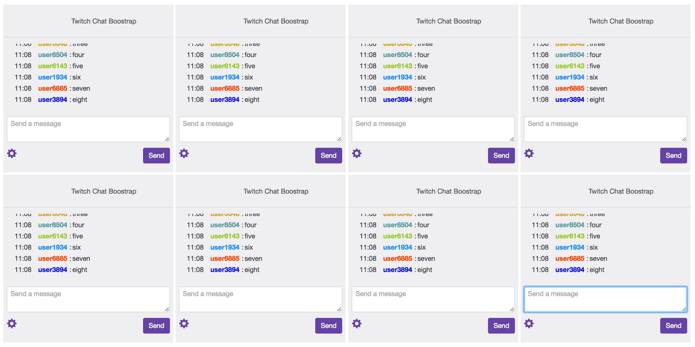

##Twitch Chat Bootstrap

###Server
1. install the dependencies `npm install`
2. run the server `node app.js`

###Client
1. Set the socket.io URL to the IP/hostname and port of your server

### Example
You can embed a chat (or multiple) in an iframe like so:

> client/example.html
